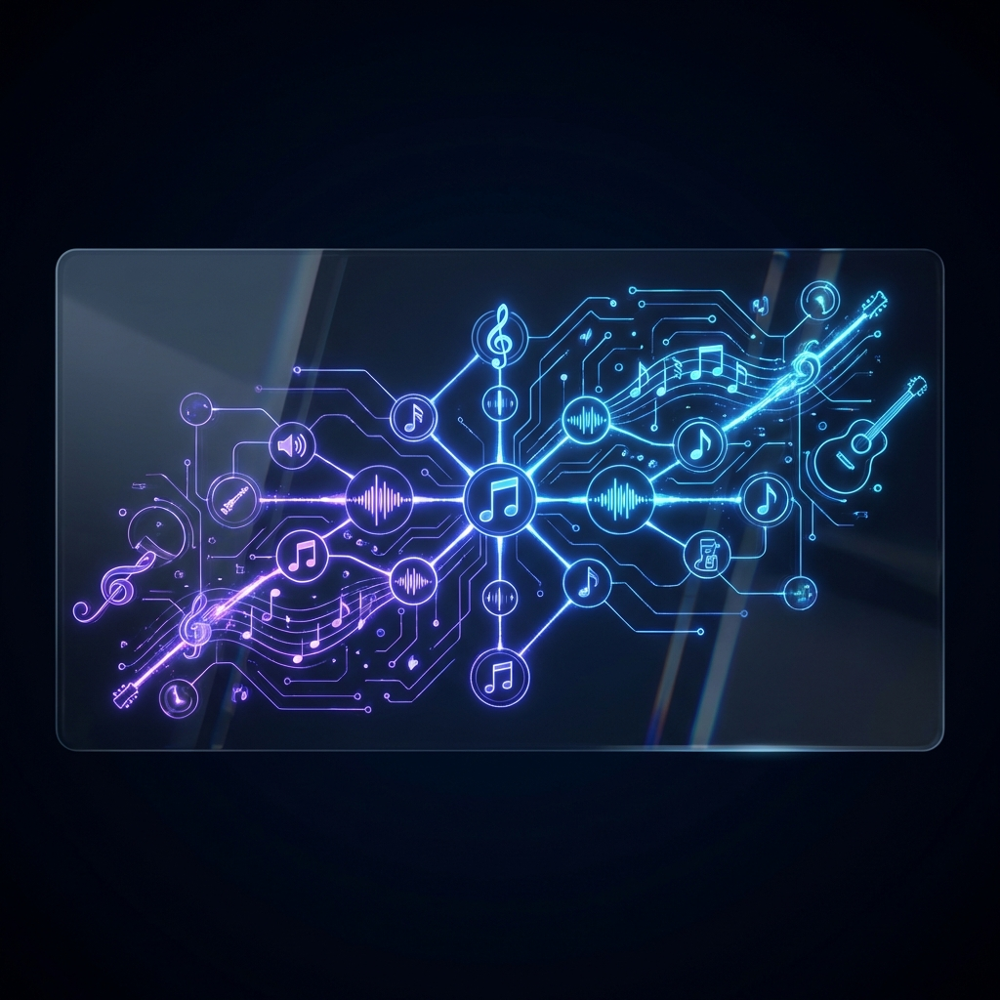
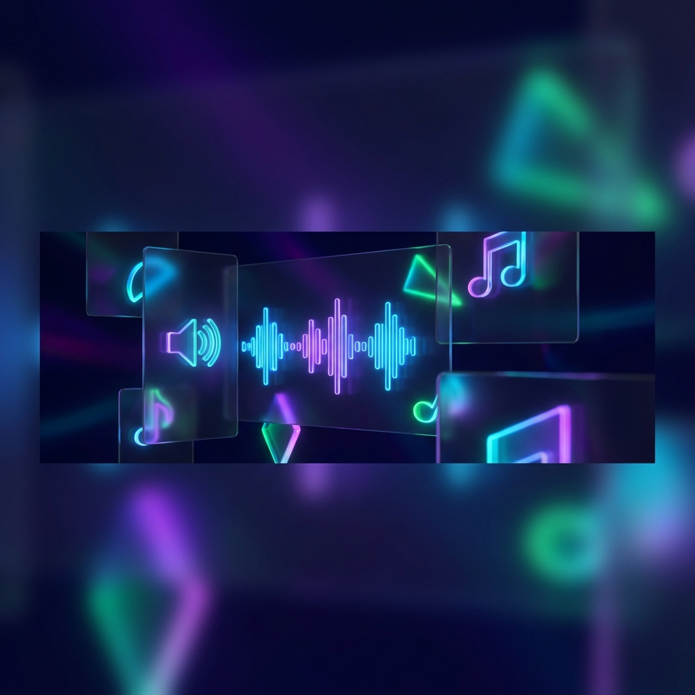

<div align="center">

# Music Automaton Composer

**A procedural melody generator built with React and the Web Audio API.**
<br>
*Explore the intersection of Music Theory and Finite State Automata.*
</div>

---

**Music Automaton Composer** is a real-time procedural music generator that visualizes the logic of melody. By applying **Finite State Automata (FSA)** principles to musical scales, it generates infinite, evolving melodies that follow strict harmonic rules while allowing for organic variation.

## 

*   **🎵 Procedural Melody Generation**: Utilizes a Markov chain-inspired FSA to navigate between musical notes (states), creating unique sequences every time.
*   **🎹 Dynamic Synthesis**: Built on the **Web Audio API**, generating sounds in real-time using selectable waveforms (Sine, Square, Triangle, Sawtooth).
*   **🎛️ Live Controls**:
    *   **Tempo**: fluidly adjust from 60 to 200 BPM.
    *   **Scales**: Switch instantly between Major, Minor, Pentatonic, Blues, Dorian, Lydian, Mixolydian, Phrygian, Harmonic Minor, and Whole Tone.
    *   **Resolution**: Control the "Tonic Pull" — how often the melody resolves home.
*   **✨ Visual Feedback**:
    *   **Glassmorphism UI**: A beautiful, modern dark-mode interface.
    *   **Active State Visualization**: See exactly which note is playing in the network.
    *   **Pulse Effects**: Visual beats that sync with the rhythm.

## 🛠️ Technology Stack

*   **Core**: [React](https://reactjs.org/)
*   **Build**: [Vite](https://vitejs.dev/)
*   **Audio**: Web Audio API
*   **Styling**: [TailwindCSS](https://tailwindcss.com/)
*   **Icons**: [Lucide React](https://lucide.dev/)

## 🚀 Getting Started

### Installation

1.  **Clone the repository**
    ```bash
    git clone https://github.com/yourusername/music-automaton.git
    cd music-automaton
    ```

2.  **Install dependencies**
    ```bash
    npm install
    ```

### Usage

1.  **Start the development server**
    ```bash
    npm run dev
    ```

2.  **Open the application**
    Navigate to `http://localhost:5173` in your browser.

## 🎼 How It Works

1.  **States & Notes**: Every note in the selected scale exists as a "state" in the automaton.
2.  **Probability Matrix**: When a note plays, the system calculates the next move based on weighted probabilities:
    *   **Step Motion**: High probability to move to adjacent notes (smooth melody).
    *   **Leaps**: Lower probability to jump larger intervals.
    *   **Resolution**: A dynamic probability that increases over time to pull the melody back to the Tonic (root note).
3.  **Real-time Synthesis**: The browser synthesizes the calculated frequency instantly—no samples, just pure math and sound.
